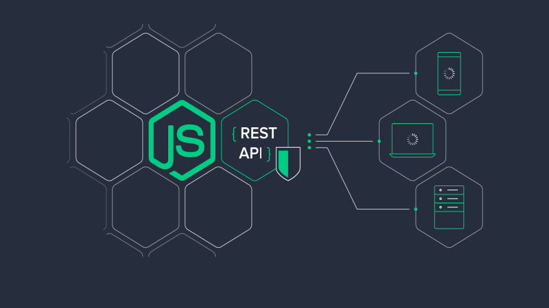
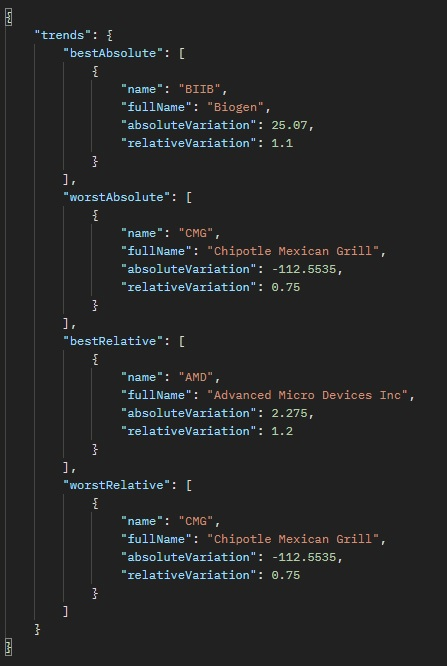
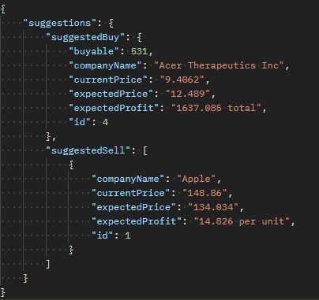
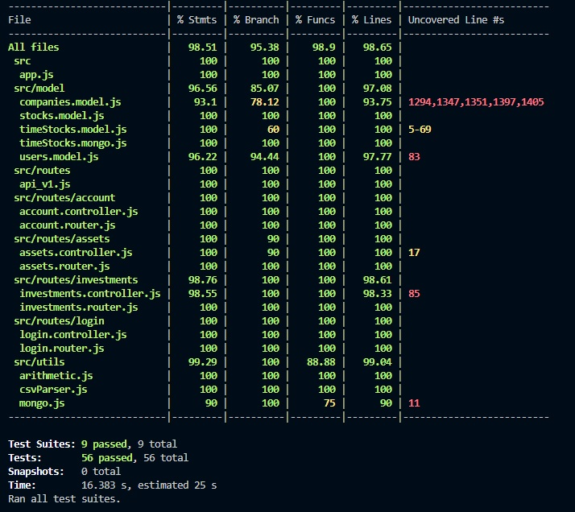

# Case XP - Backend Node

## Introdução

Backend principal do case XP. Neste projeto, se encontram todas as features obrigatórias e algumas adicionais.

## Instalando e executando o projeto
_nota: Este projeto foi desenvolvido no windows 10. Alguns comandos podem não funcionar corretamente em outros ambientes_

#### Programas Necessários
- [Node JS versão 16.13 ou superior](https://nodejs.org/en/download/)
- [My SQL Server versão 8.0 ou superior](https://dev.mysql.com/downloads/installer/)

#### Executando o projeto:

Com o terminal:
- Baixe o projeto usando `git clone https://github.com/LeandroTeixeira/case-xp.git`
- Entre na pasta do projeto utilizando `cd case-xp`
- Instale as dependências com `npm install`
- Renomeie o arquivo `.env.example` para `.env` e configure as variáveis referentes ao servidor SQL.
- Para executar o servidor, execute `npm run server`

## Modo de utilização 
_Nota: Por padrão, todas as rotas se localizam por padrão em http://localhost:8000/. A porta pode ser alterada no .env. Os retornos apresentados são os bem sucedidos, situações adversas podem resultar em respostas diferentes._ 

#### Rota GET /conta/:id 2
- Entrada: Nada
- Saída: `{"user": {"name": String, "email": String }}` (se o usuário for diferente do autenticado)
    - `{ "user": { "name": String, "email": String, "risk": 0 | 1, "funds": String Numérica}}` (se for igual)

#### Rota GET /ativos/:id 2
- Entrada: `{"type": client | asset}`
- Saída: `{[{"userId": Integer,"companyId": Integer,"amount": Integer,"value": String Numérica}]}` (se o tipo for cliente) 
    - `{"id": Integer, "name": String, "fullName": String, "amount": Integer, "value": String Numérica}` (se o tipo for asset)

#### Rota GET /ativos
- Entrada: `{"days": Number | undefined, "amount": Number | undefined}`
- Saída (exemplo): 

#### Rota POST /conta/depósito 2
- Entrada: `{"valor": Number}`
- Saída: `{ "user": { "name": String, "email": String, "risk": 0 | 1, "funds": String Numérica}}`

#### Rota POST /conta/saque 2
- Entrada: `{"valor": Number}`
- Saída: `{ "user": { "name": String, "email": String, "risk": 0 | 1, "funds": String Numérica}}`

#### Rota POST /investimentos/comprar 2
- Entrada: `{ "codCliente": Integer, "codAtivo": Integer, "qtdAtivo": Integer}`
- Saída: `{ "message": "Stocks succesfully transferred."}`

#### Rota POST /investimentos/vender 2
- Entrada: `{ "codCliente": Integer, "codAtivo": Integer, "qtdAtivo": Integer}`
- Saída: `{ "message": "Stocks succesfully transferred."}`

#### Rota POST /investimentos/:id 2
- Entrada: `{"time": Number}`
- Saída (exemplo): 

#### Rota POST /conta
- Entrada: `{"email":String, "password": String, "name": String, risk:0 | 1 | undefined }`
- Saída: `{"user": {"id": Integer, "name": String, "email": String, "password": String, "risk": 0, "funds": 0}}`

#### Rota POST /login
- Entrada: `{"email":String | undefined, "name": undefined | String, "password": String }`
- Saída: `{"user": {"name": String, "email": String, "risk": Integer, "funds": Integer}, "token": String}`

#### Rota DELETE  /conta/:id 1
- Entrada: Nada
- Saída: `{"message": String, "user": {"id": Integer, "name": String, "email": String, "password": String, "risk": Integer, "funds": Integer}}`

#### Rota PUT /conta/:id 1
- Entrada:  `{"email":String, "password": String, "name": String | undefined, risk:0 | 1 | undefined }`
- Saída: `{"user": {"id": Integer, "name": String, "email": String, "password": String, "risk": 0 | 1, "funds": String Numérica}}`

Legenda:

1: É necessário estar autenticado como root para acessar esta rota. 

2: É necessário estar autenticado para acessar esta rota.

## Test Coverage

## Desenvolvimento e desafios encontrados

#### Geral

Foi dada uma ênfase muito grande a testes neste projeto para garantir a qualidade do código, principalmente do model. Testes costumavam ser meu ponto fraco e por isso estabeleci a meta pessoal de ter ao menos 95% das linhas cobertas, tendo obtido mais de 98% no resultado final. Algumas funções como getStockPrice apresentam comportamento ligeiramente diferente se o ambiente for de testes, permitindo assim que o comportamento aleatório pensado para a função não interfira com o determinismo requerido para testá-la.

Um dos maiores desafios foi a aritmética. A ideia surgiu de um insight em que me lembrei de quando estudei a implementação do circuito elétrico de somador, junto com a imprecisão das representações de números de ponto flutuante (para mais informações sobre isso, consulte https://docs.oracle.com/cd/E19957-01/806-3568/ncg_goldberg.html). Levando em conta que o mercado de ações costuma lidar com números com muitos dígitos, achei pertinente implementá-la. Em essência, isso levou a uma refatoração do projeto, com todo número importante em operações sendo representado como String internamente.

Para algo que é conteúdo de segunda série, as operações de adição e subtração se mostraram mais trabalhosas do que eu imaginei. Para adição de números positivos, a solução foi estabelecer ambos os números com a mesma quantidade de dígitos e somar algarismo por algarismo, com uma variável offset para guardar quando o valor de uma soma fosse maior que 10. Lógica parecida foi implementada para A - B com A > B.

Os problemas surgiram ao testar situações como A + (-B) ou -A - (-B). Ao invés de criar diversas estruturas condicionais internamente para validar cada cenário, optei por usar recursividade mútua entre adição e subtração para converter o problema em algo que se encaixa no tipo que já foi resolvido. Por exemplo, A + (-B) é convertido em A - B e se B for maior que A, isso é convertido em - (B - A).

Esse tipo de técnica é perigosa porque pode surgir o cenário em que uma conversão chama a outra que chama a outra de forma infinita. Também era necessário evitar o cenário em que as conversões resultassem em um número iniciando com --. Para evitar isso, uma ordem de prioridade foi definida, com operações que trocam o sinal dos números tendo prioridade sobre operações que trocam a ordem da operação e adicionam um sinal ao resultado. Por exemplo, no caso de -A - (-B), primeiro - (-B) é convertido em + B para então -A + B ser convertido em B - A que por sua vez pode ser convertido em - (A - B) se necessário. Um outro caminho que poderia ser tomado é converter primeiro em - (-B + A) que viraria - (A - B) que por sua vez poderia ser convertido em -(-(B - A) ). Para evitar este cenário, não só houve cuidado com o código como houve ênfase nos testes em validar que todos eles estavam cobertos.

A multiplicação se mostrou bem mais simples. Visto que a ênfase desta feature é na precisão nas operações e não uma tentativa de replicar o baixo nível, a solução envolveu converter os números para inteiros, multiplicá-los e adicionar casas decimais equivalentes à soma das casas decimais dos dois números. O resultado final é uma aritmética capaz de lidar com precisão numérica.

#### Model

O desenvolvimento do projeto começou pela coleta de dados. Com isso, quando foi a hora de desenvolver o model, já sabia que seria necessário construi-lo ao redor dos dados existentes. O primeiro passo foi decidir o que seria modelado e como. Já tinha em mente ao menos três tabelas, uma para a companhia, uma para o usuário e uma para os dados extraídos da base. Ainda existia margem para variações visto que questões como como a base se relacionaria com a companhia ainda não havia sido definida claramente. Todavia, o que restava para o primeiro passo era definir como a modelagem seria feita.

A base de dados foi implementada em NoSQL usando Mongoose; a justificativa é que NoSQL oferece um escalonamento horizontal que lida melhor com quantidades grandes de dados. O preço a ser pago é que as transações não necessariamente seguem o padrão [ACID](https://en.wikipedia.org/wiki/ACID). Por outro lado, a eficiência de tabelas como Usuário e Companhia dependem mais diretamente deste princípio, o que levou à escolha de SQL implementado via Sequelize. Para mais informações sobre essa questão, as seguintes fontes auxiliaram diretamente neste processo de decisão:
- https://www.cloudzero.com/blog/horizontal-vs-vertical-scaling#:~:text=While%20horizontal%20scaling%20refers%20to,%2C%20storage%2C%20or%20network%20speed.
- https://academind.com/tutorials/sql-vs-nosql
- https://medium.com/xp-inc/design-de-sistemas-distribu%C3%ADdos-escalonamento-vertical-e-escalonamento-horizontal-a162a2c66cbe#:~:text=Entende%2Dse%20por%20escalonamento%20horizontal,no%20design%20de%20sistemas%20distribu%C3%ADdos

Sobre as tabelas em si, o primeiro modelo pensado foi o da companhia, que precisava ter o nome abreviado (para conseguir acessar os dados das suas ações). A seguir, foi o do usuário. Uma decisão de projeto tomada neste modelo foi o de definir a central como sendo um usuário. Ações disponíveis para compra e venda estão relacionadas a este usuário, denotado por possuir a propriedade isRoot = true no sistema. Não só as ações pertencem originalmente a ele, funções como "deletar usuário" só podem ser executadas se a pessoa está autenticada como root.

Modelar as ações em si foi um trabalho mais criativo. Foi considerada a ideia de colocar uma variável no modelo do Usuário ou da Companhia para guardar este valor, porém a decisão final foi criar uma tabela própria para isso chamada Stock. Ela possui somente as propriedades companyId e userId. Isso foi feito principalmente para simplificar os processos de contar, agrupar e transferir as ações. Com uma tabela à parte, isso também garante que nenhum erro de arredondamento fará ações surgirem ou sumirem. O preço a ser pago é o de memória. Na vida real, cada companhia possui milhões de ações e isso não é escalável. Visto que neste projeto a minha ênfase em termos de complexidade é na base dos preços das ações e diante da minha falta de conhecimento de como o mercado de ações realmente funciona, optei por deixar desta forma.

O último passo para construir o modelo é a definição de como os dados temporais extraídos da base de dados seriam modelados. A escolha foi em uma tabela própria sem relação com a tabela principal de ações. De forma contraintuitiva, a base de dados (definida no modelo como TimeStocks) se relaciona diretamente com a tabela Companhia, não com a Stocks.

Uma vez definidos, implementar os modelos foi feito com poucos problemas. A função mais desafiadora foi a getStockPrice do modelo Company. O objetivo era fazer esta função se comportar da maneira mais realista possível. Por exemplo, se tentar acessar o banco de dados pela manhã, ele vai retornar o valor da ação na abertura. Se o acesso for durante a noite, será retornado o valor do fechamento. Além disso, são definidos duas horas aleatórias durante o dia; consultas feitas nestes horários retornarão o valor mínimo e máximo respectivamente, com consultas feitas em qualquer outro horário retornando um valor intermediário. Além disso, todas as funções que usam a tabela TimeStocks também tiveram ênfase em desempenho ao acessar o banco de dados.

Na getStockPrice, a ideia foi usar uma técnica chamada memoization para aumentar a eficiência. Ela consiste em fazer uma função que possui uma variável chamada memória e retorna uma outra função que calcula o resultado. Esta função retornada, sempre que invocada, primeiro verifica se o resultado da operação está na memória. Se está, trabalha em cima dele. Caso contrário, o calcula e salva na memória. Memoization depende principalmente do princípio da idempotência (assume-se que duas consultas iguais ao banco de dados retornarão o mesmo resultado). Esse tipo de função que fabrica outras a serem usadas são popularmente conhecidas como [Fábricas](https://engsoftmoderna.info/cap6.html#f%C3%A1brica), aqui usada sob uma perspectiva funcional ao invés da tradicional OOP.

O resultado disso, para o usuário, é que a segunda consulta de um mesmo valor costuma ser instantânea mesmo que a primeira demore. Para o desenvolvedor, otimizar esse recurso envolve instanciar essa função apenas uma vez e passá-la como parâmetro quando necessário. Durante o desenvolvimento do Controller foi percebido que usar POO agiliza e simplifica este processo principalmente ao permitir o uso do design pattern [Singleton](https://en.wikipedia.org/wiki/Singleton_pattern), porém nesta etapa do processo o Model já estava finalizado e testado e a mudança não traria impacto suficiente para se justificar.

Memoization não foi a única técnica usada pensando em eficiência de tempo. No processo de inicialização do timeStocks primeiro verifica-se se o primeiro dado salvo existe na tabela. Só se ele não existir que as dezenas de milhares de dados são inseridos.

Outro dos desafios encontrado no model foi estabelecer a comunicação entre os backends. Para isto, foi usada a biblioteca [axios](https://axios-http.com/docs/intro) no timeStocks model.

#### Controller

Construir o Controller foi um processo de conectar os requisitos com o model. O processo, como um todo, ocorreu sem problemas. Houve uma ênfase muito grande em autenticação, com a maioria das rotas exigindo-a. Em alguns casos, mesmo autenticado a operação pode não ocorrer da forma esperada se for uma tentativa de extrair dados de outro usuário.

Existem algumas decisões de implementação dignas de serem comentadas. No getByClient, optei por exigir autenticação do usuário e dados como fundos e risco só são exibidos se forem do mesmo usuário. Deletar usuário é permitido somente ao root. No getByClients e getByAssets, por um erro de interpretação, foi construída uma mesma rota para ambos com a diferença sendo que uma recebe um parâmetro tipo = cliente e a outra recebe tipo = asset. Quando a dúvida foi esclarecida, o controller já estava pronto e optei por mantê-la.

Algumas rotas foram adicionadas, as mais notáveis sendo GET /investimentos/:id e GET /ativos. A primeira oferece sugestões de investimentos baseadas na carteira atual enquanto a segunda retorna as trends atuais, podendo receber como parâmetro a quantidade de companhias e o dia usado para comparação (se algum não for especificado, os parâmetros serão o padrão de 5 companhias e as trends dos últimos 15 dias). Esta rota também usa memoization para aumentar a eficiência.

A decisão notável aqui foi versionar a aplicação. Pensando no uso a longo prazo, achei relevante a ideia de poder refatorar o projeto e até mesmo remover rotas (como a forma como o getByAsset e getByClient estão implementados) sem comprometer a utilização dos habituados ao sistema. 
