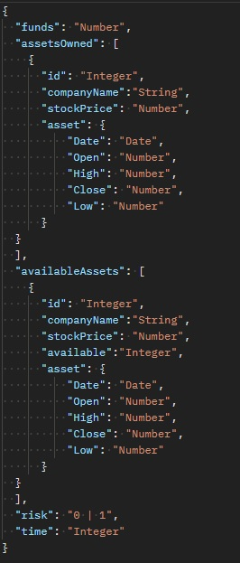

# Case XP - Data Analysis

## Introdução
O mercado de ações possui diversas informações fluindo a todo momento. Surge então um questionamento, existiria uma forma de usar essas informações para trazer valor para o cliente? Elaine Resende, cientista de dados da XP Inc, apresenta em [seu artigo no Medium](https://medium.com/xp-inc/a-ci%C3%AAncia-de-dados-com-foco-no-cliente-33bf7c209436) um framework bem útil composto de 7 passos: 

1. Entender o contexto no qual o cliente está e quais as principais variáveis envolvidas.
2. Entender os dados e validar sua disponibilidade.
3. Entender os principais fatores que impactam o negócio
4. Segmentar clientes
5. Perfilamento dos segmentos
6. Validação de grupos e criação de perfis de usuário
7. Avaliação e testes

Esses passos não são seguidos a risca devido a simplificações e é importante entender os impactos delas no projeto para extrair qualquer valor deste experimento. Para começar, devido à dificuldade de encontrar uma base de dados de qualidade, o contexto do cliente foi adaptado aos dados e não o contrário. Na ausência de dados reais de cliente, ao invés de segmentá-los usando um algoritmo como K-Means e estudar as segmentações, os perfis de usuários são supostos e trabalhados em cima (um tipo baseado em como eu agiria e que tipo de comportamento eu esperaria e o outro sendo o comportamento oposto ao meu). 

Efetivamente, trata-se de um projeto que identificou dois tipos de usuário e desenvolveu algoritmos para dar-lhes valor. Para possíveis versões futuras do projeto, é necessário generalizá-lo através deste framework para expandir a gama de consumidores que podem usá-lo.

## Instalando e executando o projeto
_nota: Este projeto foi desenvolvido no windows 10. Alguns comandos podem não funcionar corretamente em outros ambientes_

#### Programas Necessários
- [Conda versão 4.13 ou superior](https://docs.conda.io/projects/conda/en/latest/user-guide/install/download.html#choosing-a-version-of-anaconda-or-miniconda)
- [Python versão 3.8 ou superior](https://www.python.org/downloads/) (Vem incluso nos instaladores de Anaconda e Miniconda).

#### Executando o projeto:

Com o Anaconda Prompt:
- Entre na pasta do projeto usando comandos cd
- Uma vez na pasta principal, crie um conda environment executando `conda env create --file environment.yml`
- Ative o environment executando `activate LT-case-xp`
- Use `set FLASK_ENV=development` e `set FLASK_APP=server.py` para configurar o flask.
- Para executar, use `flask run`

## Modo de utilização 
_Nota: Por padrão, todas as rotas se localizam em http://localhost:5000/_ 
_Nota2: Variáveis do tipo "Number" aceitam qualquer valor numérico, seja ele inteiro, decimal ou string_

#### Rota POST /suggestions/ 
- Entrada: 

- Saída:

    
## Desenvolvimento e desafios encontrados

#### Gerais

Por mais que eu venha usando Python com certa regularidade desde 2019, os últimos meses foram dedicados somente a JS. Por conta disso, em diversos momentos tive dificuldade com a linguagem, seja funções de manipulação de Strings e Arrays até detalhes mais complexos como quais argumentos são passados por valor e quais são passados por referência (principalmente na parte do algoritmo de Machine Learning onde foi necessário copiar tabelas e poder alterar uma sem afetar a outra era pré-requisito).

Também senti falta das ferramentas que estou acostumado em JS, tais como o Linter e até mesmo a parte de testes de software.  Todavia, a maioria destes problemas foi se resolvendo conforme o servidor era desenvolvido. Para uma versão futura, da linguagem, fica a necessidade de entender e dominar ferramentas de teste. 

#### Base de Dados

Foi possível encontrar uma [base de dados](https://www.kaggle.com/datasets/borismarjanovic/price-volume-data-for-all-us-stocks-etfs?resource=download) com dados de ações que vão desde 1970 até 2017. A base possuía alguns problemas. O principal, ela possui diversos arquivos .txt identificados apenas pela sigla da companhia. Foi necessário fazer um processo lento e trabalhoso de ir até um [site referência](https://edition.cnn.com/markets) e identificar quais empresas estão associadas a cada sigla. Após a catalogação, um script pegava todos os dados dos .txt e salvava em um .csv para ser usado pelos algoritmos. No ápice, o banco de dados chegou a possuir pouco mais de 400 empresas catalogadas a mão, de um total de milhares presentes na base de dados.

A qualidade dos dados é boa, mas também apresentou seus problemas. Ao construir os algoritmos de ML, ficou logo evidente que era necessário que as empresas utilizadas possuíssem dados consistentes pelo menos nos últimos 10 anos. Isto exigiu filtrar as empresas que não atendem a este critério, processo que teve participação ativa dos testes automizados referentes à base de dados. 

Por último, após a seleção do algoritmo de Machine Learning e com uma base com mais de um milhão de dados vindo de mais de 400 empresas, foi descoberto que para fazer o treinamento do algoritmo seria necessário elevar esses dados ao quadrado, totalizando mais de um trilhão. Por isso, foi necessária uma redução massiva de empresas e informações, com uma base de mais de 400 empresas distribuídas ao longo de mais de 10 anos se reduzindo para menos de 150 empresas com informações distribuídas ao longo de 6 anos, o que representou uma redução de 75% dos dados.

A ideia original era pegar os dados que iam até 2017 e convertê-los em dados até 2023. Desta forma, seria possível fazer uma avaliação realista do algoritmo, usando dados reais para apontar quanto teria-se lucrado com as decisões tomadas 6 anos atrás. Porém, diante da necessidade de reduzir os dados, essa feature teve que ser abandonada.

#### Algoritmo de Machine Learning e de sugestão

A parte mais desafiadora do projeto. A minha experiência prévia com algoritmos de ML era majoritariamente teórica. A experiência prática consistia em entender os processos necessários para implementar um. Os problemas (reais ou simulados) resolvidos eram zero, apesar de eu ter chegado a implementar um [algoritmo para simular bases de dados para praticar](https://github.com/LeandroTeixeira/Dataset-Generator).

Apesar disso, o desafio de prever mercado de ações com ML não era algo impensado para mim. Na trilha que construí até o certificado de TensorFlow que busco há um [curso](https://zerotomastery.io/courses/learn-tensorflow/#Project) que tem como projeto final um algoritmo que usa TensorFlow para resolver esse problema. Se existe uma solução satisfatória para ele, é através de deep learning. Mais referências sobre podem ser encontradas no arquivo [Trial and Error]() que detalha minha jornada de desenvolvimento.

Sabendo disso, encarei o problema desde o início como algo que fugia das minhas capacidades e poderia muito bem não ser resolvido de forma satisfatória. Por conta disso, optei por narrar toda a minha jornada de desenvolvimento no arquivo Trial and Error com o intuito principal de, caso uma solução razoável não pudesse ser encontrada, todas as minhas tentativas até ela ficassem registradas.

A abordagem adotada sobre o problema foi desenvolver um modelo especializado para cada empresa. Além disso, foi desenvolvido um modelo focado em prever o maior valor das ações e outro para prever o menor. De forma simplificada, o comportamento do consumidor arriscado seria o de alguém que compraria as ações hoje pensando em lucrar vendendo no maior preço em N dias enquanto o de alguém menos disposto a arriscar seria o de alguém que quer comprar uma ação com previsão de lucro mesmo vendendo no menor preço daqui a N dias. De forma análoga, na hora de vender, o consumidor arriscado venderia baseado no menor preço em N dias enquanto o conservador venderia baseado no maior preço. 

Essas simplificações são questionáveis (principalmente o comportamento na hora de vender, onde um algoritmo menos simplificado lidaria com as tendências recentes na hora de diferenciar os consumidores ao invés de se resumir às perspectivas otimistas e pessimistas) mas se encaixam bem nos dados disponíveis, principalmente diante da ausência de um critério como média móvel que melhor representa o valor de uma ação em um determinado dia.

Ao implementar, o resultado foi surpreendentemente positivo. Na terceira tentativa, o resultado foi um modelo que obteve um [R²](https://en.wikipedia.org/wiki/Coefficient_of_determination) maior que 0.95 ao tentar prever o valor mínimo utilizando [Lasso](https://scikit-learn.org/stable/modules/linear_model.html#lasso), um modelo baseado em regressão linear. O resultado aparentava ser bom demais para ser verdade e logo isso se confirmou. Os dados foram modelados de forma errada, com o sucesso tendo vindo ao tentar ensinar o algoritmo a prever o máximo/mínimo através de informações obtidas no próprio dia. Na verdade, o objetivo deveria ser encontrar o preço de um dia futuro através dos dados de hoje.

Para treinar o algoritmo para isso, seria necessário ensiná-lo a prever qualquer dia a partir do dia de hoje. Isso significa treiná-lo a prever qualquer linha da tabela a partir de qualquer linha da tabela, ou seja, elevando ao quadrado a quantidade de linhas para treinamento. Isso levou ao já mencionado corte de dados, de trilhões para dezenas de milhões.

Diante do problema foi cogitado revalidar o Lasso e testar outras alternativas, principalmente porque a quantidade de dados traz à tona outros modelos que poderiam se encaixar melhor. Visto que eu desenvolvi este modelo partindo da premissa que o melhor algoritmo para isso seriam os de deep learning, foi considerada que a melhora que a troca não levaria a uma melhora o suficiente no modelo para justificar o gasto de tempo.

Construir a primeira versão do modelo foi tão fácil quanto copiar e colar os processos. Processos diferentes foram pensados(tais como usar [OneHotEncoding ou LabelEncoding](https://www.analyticsvidhya.com/blog/2020/03/one-hot-encoding-vs-label-encoding-using-scikit-learn/) nas datas para permitir que o algoritmo notasse padrões mensais e anuais), porém foram descartas pelo fato de o principal gargalo ser a quantidade dados no limite do processável. Na primeira tentativa de validação, porém, o resultado previsto foi na casa de 108. Uma investigação no algoritmo logo apontou o culpado: as datas, codificadas como números na forma YYYYMMDD, eram os maiores números e por isso os que mais influenciavam o algoritmo de regressão linear. No preparo do modelo os dados foram codificados usando a forma min-max porém na primeira validação os dados foram inseridos crus, causando este problema.

Para lidar com ele, foi necessário codificar os dados antes de testá-los. Para isso, foi necessário salvar as informações pertinentes do modelo em um arquivo à parte e utilizá-las. A codificação usada originalmente foi a MinMax que considero ser a mais apropriada para esse tipo de problema, porém estando no final do desenvolvimento e querendo correr a menor quantidade possível de riscos, troquei para o StandardScale que converte todos os dados para a Normal padronizada. Esse tipo de conversão funciona quando os dados seguem a distribuição gaussiana, o que se aplica à maioria das coisas medidas, porém tendo o mercado de ações como uma das mais notáveis exceções e por isso assumo que a única justificativa razoável para usá-la é que economizaria tempo nos ajustes posteriores. Neste ponto do projeto, meu objetivo já se resumia a "desenvolver um algoritmo capaz de oferecer previsões realistas".

Ainda surgiram problemas com as datas antes da implementação final. Por se tratar de um dado (o único) em que os dados na validação são necessariamente maiores do que os usados para o treinamento, isso fez com que o problema de escala persistisse em uma forma menos extrema. Para resolvê-lo, a média e o desvio padrão utilizados para converter os valores para a Normal padronizada foram manipulados de forma semi-arbitrária até o resultado serem valores na mesma escala dos outros utilizados. A forma de escalar as datas permanece sendo o maior ponto fraco do código; a única solução que consigo pensar que resolveria de forma plausível sem soar arbitrária seria codificando antes de normalizar.

As simplificações feitas no modelo impactaram diretamente o algoritmo de sugestão que por sua vez também teve suas simplificações detalhadas no Readme principal. No fim, aprendi mais sobre uso de ML para resolver problemas reais ao produzir esse algoritmo e ver na prática a necessidade de cada parte do processo do que nos últimos meses estudando teoria.

#### Servidor Flask

Transmitir os dados do algoritmo de ML para o backend principal em Node foi um desafio à parte. Não é a primeira vez que realizo esse tipo de conexão num contexto semi-profissional, tendo desenvolvido no Fórmula uma aplicação web que se comunicava com um backend em Python via Socket. Na época cheguei a tentar desenvolver essa comunicação via http, mas encontrei diversas dificuldades e abandonem em prol do tradicional socket.

As minhas motivações para sair da minha zona de conforto e abraçar o desconhecido foram três. A primeira, ao desenvolver desta forma eu permito que qualquer pessoa possa usar o sistema de sugestão, bastando passar os dados da forma apresentada na seção anterior. A segunda, sendo o backend Node inteiro feito em cima desta forma de comunicação, estabeleço um padrão para todo projeto ao usar a mesma forma para ambos os servidores. A terceira, sendo este um desafio técnico para o processo seletivo da XP Inc, busco sempre que possível mostrar o meu alinhamento aos valores XP, neste caso, a capacidade de sair da zona de conforto sem medo de errar.

A primeira versão do projeto era um HelloWorld como ensinado pelo [pythonistaplanet](https://pythonistaplanet.com/flask/). Eventualmente, o projeto foi ganhando forma através de consultas à [documentação oficial](https://flask.palletsprojects.com/en/2.1.x/tutorial/). Aqui, o maior desafio (além de reaprender Python depois de meses codando em JS) foi entender como Flask lida com suas requisições e principalmente suas respostas, a forma de definir o status da solicitação, como o backend Node acessa esta informação e como transmiti-la de volta. A parte do servidor Node também apresentou seus problemas que são detalhados no Readme correspondente. Eventualmente, a documentação oficial se mostrou completa e clara o suficiente para me guiar à solução de todos os problemas referentes a este projeto.
